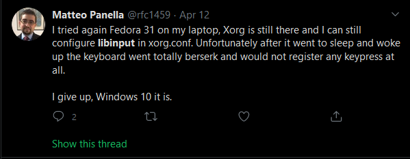
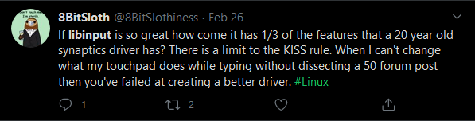
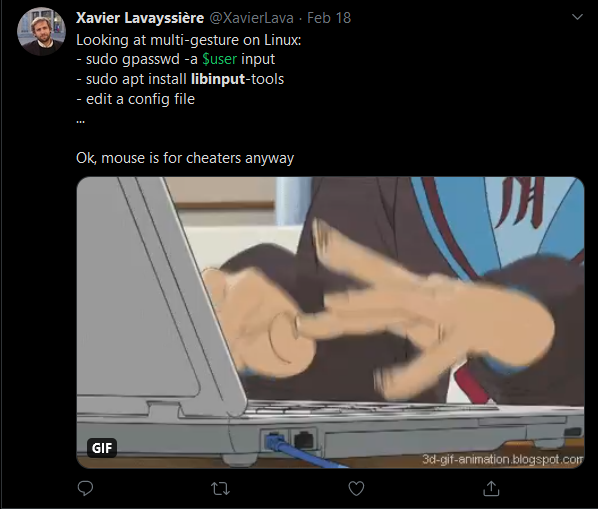
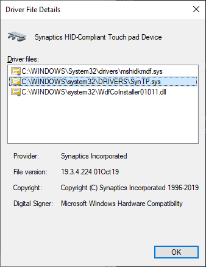
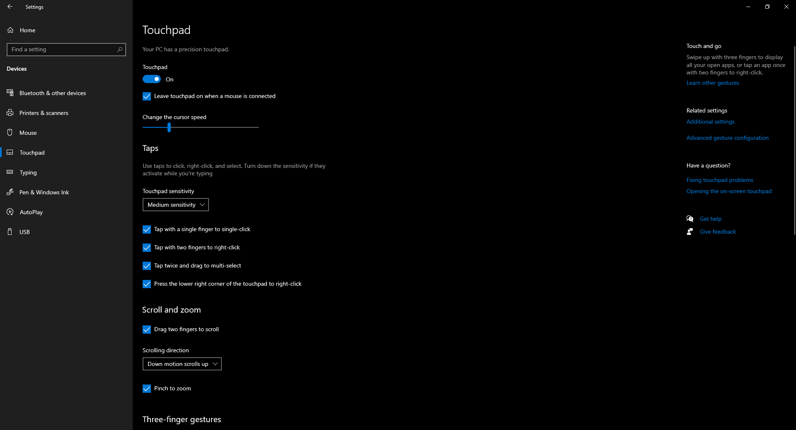

# Why linux does not have a touchpad as good as a Macbook Pro

## Motivation
I'm an avid reader of [Hacker News][hn] and one day Bill Hardings post of [Linux touchpad like a Macbook: goal worth persuing?][bill1] caught my attention.
Having tried Linux, OS X and Windows 10, I couldn't agree with the author more.
Then [another post from Bill][bill2] and finally [the last post][bill3] got me thinking: Why is this so hard?
In this post, I will be trying a bit to explain on why this is difficult and how it could maybe be implemented.

Upon reading all of the comments on [Hacker News][hn-bill3], I stumble upon a general resource like this post by Pavel Fatin: [Scrolling with pleasure][pfatin] (2017).
Pavel Fatin implemented smooth scrolling in IntelliJ and I guess he also had to do extensive research in order to simply understand how it works on every platform.
For trying to understand why scrolling in particular is so hard, this is the best resource I have found so far.

## History
In the past a hardware manufacturors made the drivers for linux to use.
This resulted in drivers like synaptics.
Synaptics was both great and a curse in an on its own.
Quirks with each individual touchpad resulted in a bucketload of settings for these touchpads.
Also in the driver were some special features like kinetic scrolling.
In the driver, the only way that synaptics could create kinetic scrolling was as a driver to keep outputting events after the user had lifted his/her fingers from the touchpad. This resulted in an experience where if another windows popped up, the scrolling would continue in that window. [Source (libinput FAQ)][libinput-kinetic-scroll]

## Libinput
Along came [libinput].
Libinput is supposed to be a monolithic driver which supports all keyboards, mice and drawing tablets[0].
It aims to be only as configurable as needed. So from for example the synptics drivers 70 configuration parameters, we now have 8. (Source needed).
Some might think: My old driver was infinitely better! More configuration = better. But in reality, the goal of libinput is to handle all of the different quirks with hardware sensors.
Additionally, libinput can do rudimental things like thumb detection.

But ultimatly, libinput gets a lot of flag for not being what some of the old drivers used to do.
Example: 

[Tweet][twitter-libinput1]

[Tweet][twitter-libinput2]

[Tweet][twitter-libinput3]

[Tweet][twitter-libinput4]

(The final one being my favourite)

But please, **please** understand this is just an outlet for frustration. Their touchpad experience is bad and their inability to do something about it is simply frustrating.

## xf86-input-libinput
Now libinput is really meant to be used for wayland, but since some compatibility was kept, it could also be used to X11 with a small shim. As such the project [xf86-input-libinput] as born.

xf86-input-libinput converts what libinput outputs into something that X11 understands.

## x11
The X server is quite old and some developers seem to dislike it a lot. Some speculate that wayland is a better way to move forward. But the fact is that currently not all applications support wayland 

## But wait, I dont want to know this, I just want features.
Well all of this depend on the applications understanding this

- Firefox? Build the feature into GTK 
- VSCode/Slack/Discord? Built the feature into Electron
- Gnome? Build the feature into Gnome
- 

## The stack of input
- Kernel
- evdev?
- libinput
- xf86-input-libinput
- xserver
- xcb
- i3

## A word on windows 10 support
Now a look at how Windows got a better touchpad. To do that, we need to go back to 2013.
This was a time where Steve Ballmer still was CEO of Microsoft and the assistant was called "Bing".
At Microsoft Build conference 2013, they could finally announce that they were working on DPI aware displays and a precision touchpad in the session [Power Up Your Desktop App with Windows 8.1][microsoft-precision]

From this point, instead of hardware vendors implementing a driver and greatly differentiating the experience of the user, Microsoft now said: You send ud the input from your driver directly to this API and your trackpad will be marked "Windows Precision Touchpad".
And users absolutely loved it.
Writeups like these [ArsTechnica][ars], [The Verge][theverge] and [PCMag][pcmag] are a statement of their success.
Even in 2015, at WinHEC (Windows Hardware Engineering Conference, held in Shenzhen, China) Microsoft tried to convince hardware partners why Precision Touchpad drivers are great with the talk [Input][winhec-input]

Looking a bit more into what Microsoft does, [the implementation guide][windows-precision-guide] from Microsoft posts the following quote:

*You only need to report the usages that are described in this topic in the firmware for your Windows Precision Touchpad. Windows will use your firmware and its own HID drivers to enable mouse and gesture capabilities for your device and furnish Windows applications with access to your device.*

Looking at my driver on my own T480 running Windows, I can see that Synaptics are still providing the driver:

Which in turn gives me the Windows Precision Touchpad:

## A look at Chrome OS
[Chrome OS][chromeos] is the default OS on chromebooks. From reading some of the comments, someone suggested it might be worth looking at, since it is linux based.
Looking through it, it might seem okay, but then you notice that [chrome OS has removed X11][remove-x11-chrome-os] and is now running on [Ozone][chrome-ozone] which has a custom written inputcontroller. While I have not read through this I porting this might be a difficult task.
Additionally, to completly answer the question, one would have to understand the whole display stack in Chrome OS.

## i3
Personally, I use i3. Reading though some of the code, I find the following constants:
https://github.com/i3/i3/blob/f63a4bef5471d73428808ecc5b8dd76ff04a23f4/include/libi3.h#L27-L35
To me this says that i3 only supports 3 mouse buttons and 4 different scroll directions.

This leads to projects like [libinput-gestures][libinput-gestures].
Now what does libinput-gestures do?
It reads libinput and executes commands to X11 using [xdotool][xdotool]

Seeing how much you have to assemble in order to just make a settings page referencing all of these settings, it's no wonder that configuration have to be done on a very specific place each time.
How the hell are users supposed to understand this tech stack.
It took me 2 days to understand some of the picture. And even then I don't feel like I have a long way to go.

My guess on why linux doesn't support touchpad as well as macOS is probably because of the "Works on my machine". And maybe the fact that people find the touchpad good enough for the daily use.
Additionally, once the problem goes away, noone thinks about the issue any more.
Well except maybe Peter Hutterer.

So to conclude. To implement the touchpad feature that you want, you need to go throught the whole input stack and figure out what part does not have support for your feature.
Then comes the task of actually writing the code.

My idea?
Without any knowledge on how xserver works:
Add another input and output API inside xserver which has support for gestures, high precision scrolling etc. 
Inside xserver, for compatibility reasons, copy duplicate the events sent into the old output API.
Now clients have to decide which API they want to use, but atleast now they have the option instead of resorting to hacks around what is currently there.

## XCB
X protocol C-language Binding also known as XCB is a client side library implementing the X11 protocol.

## Wordlist
### Kinetic scrolling
Scrolling which you start and it keeps on moving after you release the touchpad.

Watch Peter Hutterer's talk at linux.conf.au 2020 on ["Write a single library to handle all input devices, it'll be easy" they said...][whot-lac-2020]
Here he explains all about what is so great about libinput.

I can also recommend you to support libinput in any way possible. Peter Huttere is more or less the [sole developer on libinput][whot-bus1].

## Where to go from here
Potential sponsors:
- [System76][system76] with Pop_os!
- [Dell][dell] with their XPS Developer Editions.
- [Lenovo][lenovo] with their laptops with Fedora installed on it

The X11 API is too simple.
Reading the [X Input Driver HOWTO guide][xorg-input-driver] on x.org's website it seems that the protocol is super simple.
They don't differentiate between a mouse or even a tablet.
A input device simply has [a limited set of functions to call][xorg-input-code]. The receiver is not aware of what kind of input device it is actually talking to.
Some features that might be differentiable:
For scrolling: Is the user using a high precision scrollwheel (Like Logitech free-spin scrollwheel or even a touchpad)?
These features could be different, depending on the input device type.
As mentioned earlier, libinput actually knows this and addtionally provides an API for getting the type of source who generated the scroll event:
`libinput_event_pointer_get_axis_source()`
Unfortunatly, only [weston][weston-compositor] (the reference compositor for wayland) seem to actually use this feature.

[libinput]: https://wayland.freedesktop.org/libinput/doc/latest/
[xf86-input-libinput]: https://github.com/freedesktop/xorg-xf86-input-libinput
[hn]: https://news.ycombinator.com/
[bill1]: https://bill.harding.blog/2018/04/12/linux-touchpad-like-a-macbook-goal-worth-pursuing/
[bill2]: https://bill.harding.blog/2019/03/25/linux-touchpad-like-a-macbook-progress-and-a-call-for-help/
[bill3]: https://bill.harding.blog/2020/04/26/linux-touchpad-like-a-macbook-pro-may-2020-update/
[microsoft-precision]: https://channel9.msdn.com/Events/Build/2013/3-017
[ars]: https://arstechnica.com/gadgets/2016/10/pc-oems-ditch-the-custom-touchpad-drivers-give-us-precision-touchpad/
[theverge]: https://www.theverge.com/2019/5/28/18638862/hp-trackpad-windows-precision-drivers-fix-envy-laptops-hardware
[pcmag]: https://uk.pcmag.com/input-devices/86917/microsoft-eyes-precision-touchpad-requirement
[twitter-libinput1]: https://twitter.com/jneen_/status/1258269476258226178
[twitter-libinput2]: https://twitter.com/rfc1459/status/1249426888864477184
[twitter-libinput3]: https://twitter.com/8BitSlothiness/status/1232538068630036480
[twitter-libinput4]: https://twitter.com/XavierLava/status/1229884284015718402
[whot-lac-2020]: https://www.youtube.com/watch?v=HllUoT_WE7Y
[whot-bus1]: https://who-t.blogspot.com/2019/10/libinputs-bus-factor-is-1.html
[system76]: https://system76.com/
[dell]: https://www.dell.com/en-us/work/shop/dell-laptops-and-notebooks/new-xps-13-laptop/spd/xps-13-9300-laptop#Linux-based%20developer%20edition
[lenovo]: https://www.notebookcheck.net/Lenovo-and-Fedora-Project-confirm-partnership-for-Fedora-versions-of-the-ThinkPad-P1-Gen-2-ThinkPad-P53-and-ThinkPad-X1-Gen-8.462891.0.html
[pfatin]: https://pavelfatin.com/scrolling-with-pleasure/
[winhec-input]: https://channel9.msdn.com/Events/WinHEC/WinHEC-December-2016/Input
[windows-precision-guide]: https://docs.microsoft.com/en-us/windows-hardware/design/component-guidelines/windows-precision-touchpad-protocol-implementation
[xorg-input-driver]: https://www.x.org/wiki/Development/Documentation/XorgInputHOWTO/
[xorg-input-code]: https://github.com/freedesktop/xorg-xserver/blob/master/hw/xfree86/common/xf86Xinput.h#L120-L176
[weston-compositor]: https://github.com/wayland-project/weston
[hn-bill3]: https://news.ycombinator.com/item?id=23080435
[libinput-gestures]: https://github.com/bulletmark/libinput-gestures
[xdotool]: https://www.semicomplete.com/projects/xdotool/
[libinput-kinetic-scroll]: https://wayland.freedesktop.org/libinput/doc/latest/faqs.html#kinetic-scrolling-does-not-work
[chromeos]: https://www.google.com/chromebook/chrome-os/
[remove-x11-chrome-os]: https://www.phoronix.com/scan.php?page=news_item&px=Chrome-OS-X11-Free
[chrome-ozone]: https://chromium.googlesource.com/chromium/src.git/+/master/docs/ozone_overview.md